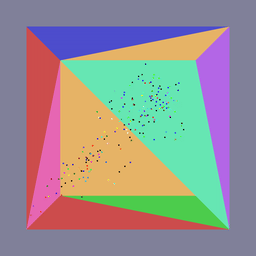

# Godot Boids Simulation with C++ GDExtension and CUDA

## Description

This is a C++ physics library developed based off of lectures from [Dr. Tessendorf's](https://jtessen.people.clemson.edu/) class DPA 6190: Introduction to Physically Based Modeling and Animation. All of the code that I have written is in the things folder. The rest were provided helpful classes like some linear algebra stuff and the Things framework for viewing the simulations. 

## Features

*   **Dynamical State Data:** A structure of arrays container for particle data.
*   **Generic Integrator Solvers:** Composable integrators allowing users to use standard integrators such as forward/backward eulor or leapfrog solvers with collision detection and spatial hashing optimizations.
*   **Soft Body Dynamics** Solvers and data structures for spring strut networks for soft bodies.

*   **Rigid Body Dynamics** Solvers and collision response for Rigid Bodies.

*   **SPH** Solvers, data structures, and spatial hashing optimizations for Smoothed Particle Hydrodynamics.

*   **Flocking Simulations** Flocking based on the classic Boids algorithm using a functional approach to particle behaviors.

*   **Templated Occupancy Grid** An extendable and templated occupancy grid that allows users to place any data structures within the grid. Helper functions to accumulate a provided function over all neighboring cells.

## Prerequisites

*   **C++17 Compiler** This library makes use of the C++ STL and uses a fair amount of C++17 features.

## Building the Physics Sim

The Makefile allows for three different ways of making this library. You can simply `make` to compile all of the code. `make sim` to build `pbalitesim` and run whichever `thing` has been coded to run, or you can `make test` to build and run unit tests. We will just go over the `make sim` option.

1.  The "main" file in this repo is in `things/src/pbalitesim.cpp`. You can choose which thing to run there. 
2.  In the terminal run: `make sim`. This builds everything and puts pbalitesim in bin
3.  In the terminal run: `./bin/pbalitesim`. This will run whichever `PbaThing` has been added to the viewer in `pbalitesim`.  
